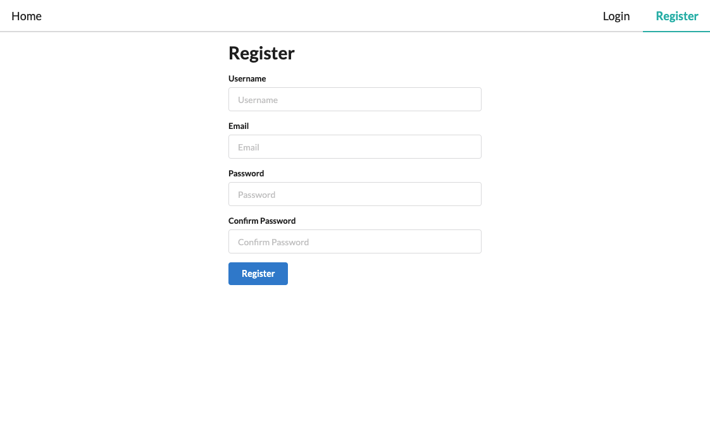

# Meeper

## Description

An easy-to-use social media application for posting, liking, and commenting on "Meeps". Inspired by Twitter

## Table of Contents

- [Installation](#installation)
- [Usage](#usage)
- [Technologies](#technologies)
- [Deployed URL](#deployed-url)
- [License](#license)

## Installation

## Usage

- Register an account, or log in.
- Once logged in:
  - Create new posts with the form on the left hand side
  - View individual posts by clicking its time stamp
  - Like/Unlike posts with the 'heart' `Like` button
  - Comment on a post with the 'comment bubbles' `Comment` button
  - Delete any of your own posts/comments using the 'trash can' `Delete` button
  - Logout at any time

> Register page

> Login page

> Home page

> Single post page

## Technologies

- `HTML`
- `CSS`
- `JavaScript`
- `MongoDB`
- `Express.js`
- `React.js`
- `Node.js`
- `GraphQL`
- `Apollo`
- `CSS` and `Semantic UI React`/`Semantic UI CSS` framework
- `React-router`
- `Moment.js`
- `JSON Web Token`
- `Bcrypt`

## Deployed URL

[https://clever-galileo-e0340b.netlify.app/](https://clever-galileo-e0340b.netlify.app/)

## Questions

If you have any questions, please contact jimbopulos at james.mgalantino@gmail.com

## License

MIT License

Copyright (c) 2021 James Galantino

Permission is hereby granted, free of charge, to any person obtaining a copy
of this software and associated documentation files (the "Software"), to deal
in the Software without restriction, including without limitation the rights
to use, copy, modify, merge, publish, distribute, sublicense, and/or sell
copies of the Software, and to permit persons to whom the Software is
furnished to do so, subject to the following conditions:

The above copyright notice and this permission notice shall be included in all
copies or substantial portions of the Software.

THE SOFTWARE IS PROVIDED "AS IS", WITHOUT WARRANTY OF ANY KIND, EXPRESS OR
IMPLIED, INCLUDING BUT NOT LIMITED TO THE WARRANTIES OF MERCHANTABILITY,
FITNESS FOR A PARTICULAR PURPOSE AND NONINFRINGEMENT. IN NO EVENT SHALL THE
AUTHORS OR COPYRIGHT HOLDERS BE LIABLE FOR ANY CLAIM, DAMAGES OR OTHER
LIABILITY, WHETHER IN AN ACTION OF CONTRACT, TORT OR OTHERWISE, ARISING FROM,
OUT OF OR IN CONNECTION WITH THE SOFTWARE OR THE USE OR OTHER DEALINGS IN THE
SOFTWARE.
